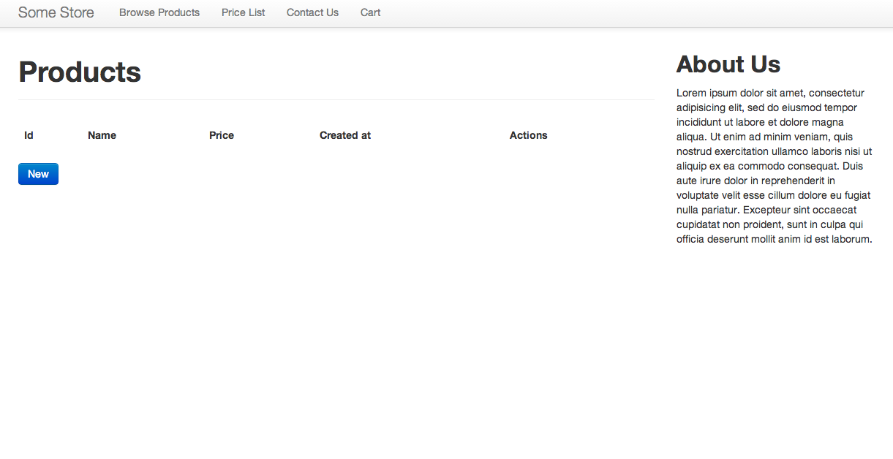

# Bootstrap-Store

By [Phil Worthington](github.com/philworthington).

## Description
**Bootstrap-Store** This is a simple product store built in Rails 4 and styled using Twitter Bootstrap.

## Installation

Installation information provided in http://railscasts.com/episodes/328-twitter-bootstrap-basics and https://github.com/seyhunak/twitter-bootstrap-rails for newer versions of bootstrap and rails.

## Usage

This app can be used as a simple product store, listing inventory and common information such as prices.

## Information

Screenshots of your application below:

## Authors

* [Phil worthington](github.com/philworthington)

## License

MIT: http://philworthington.mit-license.org

